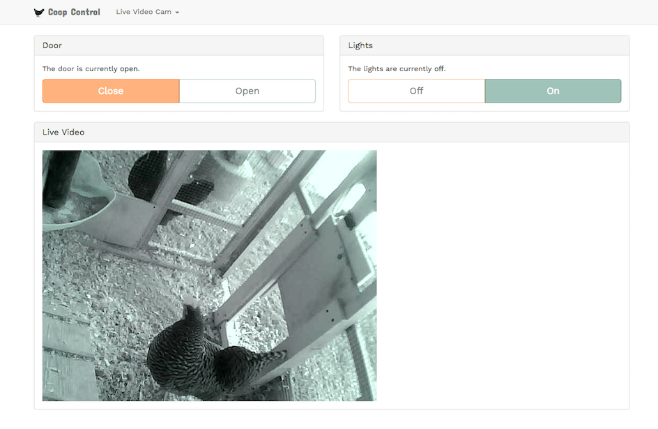

# Automated Chicken Coop Control

## Web Service & Status Page

This code is used to run a JSON webservice with Python, Flask, and Nginx. Since the index.html page uses [Bootstrap](http://getbootstrap.com) it should be mobile friendly for most everyone. Now I can open the chicken coop door from my phone!

